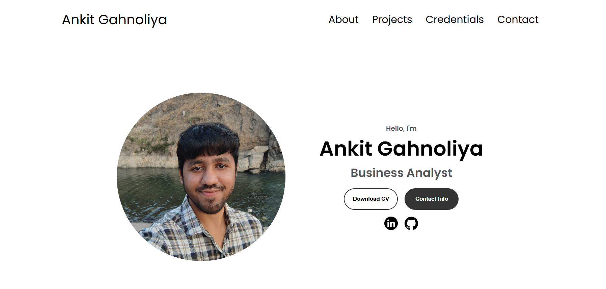
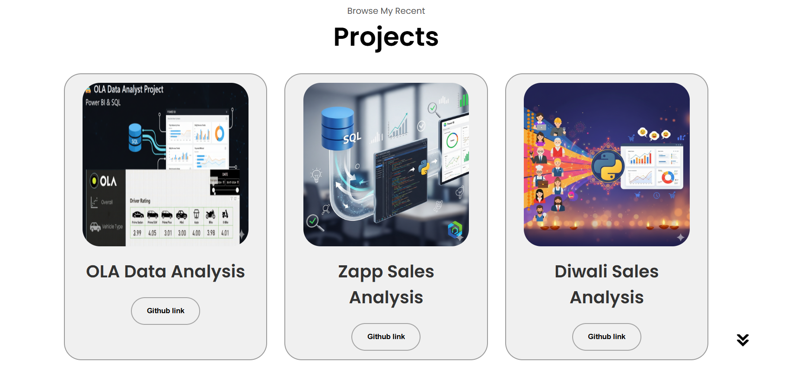

# 🌐 Portfolio Website

This is my **personal portfolio website** built using **HTML, CSS, and JavaScript**.  
It showcases my projects, skills, and contact details. The site is fully responsive and hosted on **GitHub Pages**.

---

## 🚀 Live Demo
🔗 [Click here to visit my portfolio](https://ankit-gahnoliya.vercel.app/)

---

## 📸 Screenshots

### 🏠 Homepage

### 💼 Projects Section

---

## 🛠️ Tech Stack
- **HTML5** – Structure  
- **CSS3** – Styling  
- **JavaScript (ES6)** – Interactivity  

---

## 📬 Contact
If you’d like to connect, feel free to reach out:  

📧 Email: ankitg4402@gamil.com  
💼 LinkedIn: [Ankit Gahnoliya](https://www.linkedin.com/in/ankitgahnoliya/)
